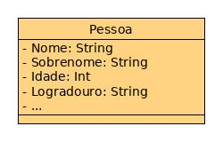

# ORM e SQLAlchemy

## ORMs

ORM é um acronomo para Object-relational mapping. Ou em tupiniquim: "mapeador de objeto relacional??"

Vamos primeiro pensar que existe o mundo OO (Orientado a objeto) e o mundo relacional. Um ORM tentacontruir uma interface entre esses dois mundos. Se pensar bem, uma classe somente de atributos pode representar uma tupla de banco de dados.

Vamos representar usando UML, embora todo mundo já esteja careca de saber disso.

Simplicando bem o diagrama da classe (da figura 1) chegaremos a esse nível de abstração. Que pensando bem, só não expecifica bem para o mundo relacional se os campos são nulos ou que chega a ser uma chave primária ou secundária.

Figura 1: UML simplificado

Dito isso, a abstração é bem mais fácil de se pensar (figura 2). Ou seja, vamos pensar que o ORM nos fornece uma boa interação e nos fornece os tipos prédefinidos para que a interação seja transparente. Lembrando que estamos falando de python e a tipagem aqui é dinâmica. Então o ORM vai nos fornecer uma maneira de fazer nossas interações usando a linguagem nátiva (não convertendo ou escrevendo SQL), existem lados positivos e lados negativos envolvidos nisso, mas isso pode ser assunto pra uma live expecífica.

(fazer imagem 2)

Vamos partir do ponto em que cada linha do nosso banco seja referência a uma instância de uma classe. E essa classe monta um esqueleto do esquema da tabela. Assim, toda nossa interação com o banco é feita usando linguagem nativa, no nosso caso python. Imagina um dar um `for` em uma table. Sim, as coisas ficam muito mais simples. Mas não vamos no extender. Agora você já sabe a função de um ORM

----

## SQLAlchemy
SQLAlchemy é uma biblioteca usada para interagir com uma grande variedade de bancos de dados. Ele permite que você crie modelos e consultas de dados de uma maneira que se sente como Pythonclasses e declarações normais. Criado por Mike Bayer em 2005, o SQLAlchemy é usado por muitas empresas grandes e pequenas, e é considerado por muitas como a maneira de fato de trabalhar com bancos de dados relacionais em Python.

Ele pode ser usado para se conectar aos bancos de dados mais comuns, como Postgres, MySQL, SQLite, Oracle e muitos outros. Ele também fornece uma maneira de adicionar suporte para outros bancos de dados relacionais também. O Amazonshshift, que usa um dialecto personalizado do PostgreSQL, é um excelente exemplo de suporte de banco de dados adicionado pela comunidade.

Neste capítulo, exploraremos por que precisamos de SQLAlchemy, conheça os dois principais modos e nos nos conectamos a um banco de dados.

----

## Camadas do SQLAlchemy
O SQLAlchemy também fornece muita flexibilidade ao fornecer dois modos principais de uso: Idioma de Expressão SQL (comumente referido como Núcleo) e ORM. Estes modos
Podem ser usados separadamente ou juntos de acordo com sua preferência e as necessidades de
Sua aplicação.

### Núcleo:

- Maneira pythonica de representar declarações e expressões SQL comuns e é apenas uma abstração suave do SQL típico;

- Está focado no esquema do banco de dados real;

- No entanto, ele é padronizado de forma que ele fornece um idioma consistente em um grande número de bancos de dados do backend.

### ORM:
