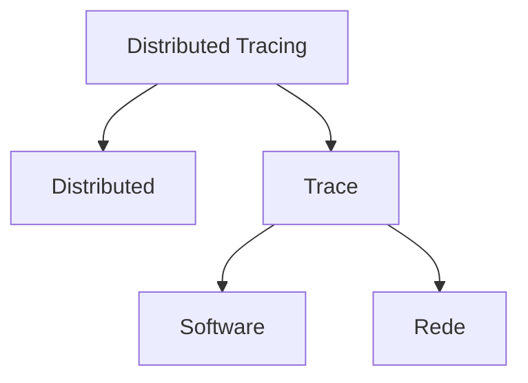
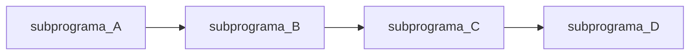
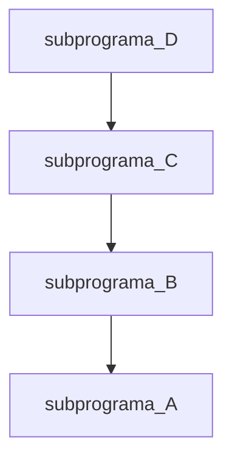
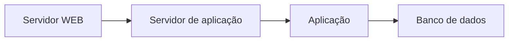
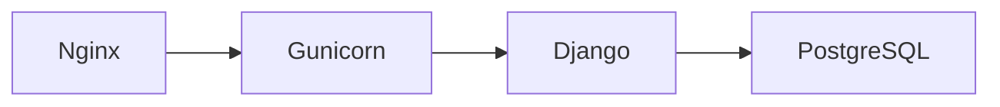

# Distributed Tracing

## Roteiro

1. Vocabulário de nicho
   
   1. Tracing
      
      1. De software
      
      2. De rede
   
   2. Distributed

2. Otel + Tracing
   
   1. Traces
   
   2. Spans
   
   3. Contextos
   
   4. Eventos

3. Instrumentação **manual**
   
   1. Resource
   
   2. Rastro / Span
   
   3. ...
   
   4. Código (????)

4. Instrumentação **automática**
   
   1. Otel Distro (ok)
   
   2. Tarefas em primeiro plano (ok)
   
   3. Tarefas em segundo plano (ok)
   
   4. Delegação de contexto (http request) (ok)

## Vocabulário de nicho



### Traces

<blah>

#### Trace de Software

Trace pode ser traduzido como "Rastro", quando a aplicação vai pulando entre subprogramas vai deixando um rastro.



Por exemplo:

```python
def d(): return 42
def c(): return d()
def b(): return c()
def a(): return b()

a()
```

A execução

```
$ python -m trace -T exemplo_01.py 
42

calling relationships:

*** /usr/lib/python3.11/trace.py ***
  --> exemplo_01.py
    trace.Trace.runctx -> exemplo_01.<module>

*** exemplo_01.py ***
    exemplo_01.<module> -> exemplo_01.a
    exemplo_01.a -> exemplo_01.b
    exemplo_01.b -> exemplo_01.c
    exemplo_01.c -> exemplo_01.d
```

Trace **BACK**

Alterando um código para gerar um erro

```python
def d(): return 1/0
def c(): return d()
def b(): return c()
def a(): return b()

a()
```

Geraria esse erro ao ser executado:

```python
$ python exemplo_01.py 
Traceback (most recent call last):
  File "/home/dunossauro/live_traces/exemplo_01.py", line 7, in <module>
    print(a())
          ^^^
  File "/home/dunossauro/live_traces/exemplo_01.py", line 4, in a
    def a(): return b()
                    ^^^
  File "/home/dunossauro/live_traces/exemplo_01.py", line 3, in b
    def b(): return c()
                    ^^^
  File "/home/dunossauro/live_traces/exemplo_01.py", line 2, in c
    def c(): return d()
                    ^^^
  File "/home/dunossauro/live_traces/exemplo_01.py", line 1, in d
    def d(): return 1/0
                    ~^~
ZeroDivisionError: division by zero
```



#### Trace de rede

Quando pensamos em um rede como a internet, quando precisamos acessar um site, por exemplo, temos um longo caminho a percorrer entre meios guiados e não guiados.

Precisamos sair do nosso computador, ir para o nosso roteador, que vai para o poste, que provavelmente tem outro roteador, que se liga em outro roteador, até chegar no computador (*servidor*) que está hospedando o site que queremos acessar.

---

Uma boa forma de ver o caminho que uma requisição faz do seu computador até chegar no computador "requerido" é via o comando `traceroute`:

```bash
$ traceroute ddg.gg

traceroute to ddg.gg (40.89.244.232), 30 hops max, 60 byte packets
 1  _gateway (192.168.15.1)  8.881 ms  8.983 ms  9.253 ms
 2  * * *
 3  152-255-156-90.user.vivozap.com.br (152.255.156.90)  14.072 ms  14.195 ms 152-255-156-92.user.vivozap.com.br (152.255.156.92)  14.349 ms
 4  187-100-60-180.dsl.telesp.net.br (187.100.60.180)  22.859 ms  22.715 ms  22.567 ms
 5  152-255-209-79.user.vivozap.com.br (152.255.209.79)  19.549 ms  23.303 ms 187-100-57-59.dsl.telesp.net.br (187.100.57.59)  20.029 ms
 6  * * *
 7  * * *
 8  * * *
 9  84.16.11.51 (84.16.11.51)  13.516 ms  13.423 ms 5.53.3.16 (5.53.3.16)  15.590 ms
10  ae27-0.ear04.gru30.ntwk.msn.net (104.44.231.102)  16.516 ms  17.158 ms 84.16.11.61 (84.16.11.61)  13.007 ms
11  * * ae27-0.ear04.gru30.ntwk.msn.net (104.44.231.102)  19.795 ms
12  be-23-0.ibr01.gru30.ntwk.msn.net (104.44.34.12)  164.518 ms be-2-0.ibr02.sao30.ntwk.msn.net (104.44.16.198)  167.909 ms be-23-0.ibr01.gru30.ntwk.msn.net (104.44.34.12)  186.292 ms
13  * be-9-0.ibr02.rio02.ntwk.msn.net (104.44.18.62)  182.962 ms  183.057 ms
14  be-2-0.ibr04.orf70.ntwk.msn.net (104.44.18.55)  189.600 ms be-8-0.ibr01.fll30.ntwk.msn.net (104.44.16.46)  194.895 ms *
15  be-6-0.ibr04.bn6.ntwk.msn.net (104.44.29.143)  189.550 ms be-6-0.ibr01.mia.ntwk.msn.net (104.44.19.14)  192.204 ms be-2-0.ibr04.orf70.ntwk.msn.net (104.44.18.55)  189.525 ms
16  be-8-0.ibr02.atl31.ntwk.msn.net (104.44.29.39)  189.519 ms  189.514 ms be-10-0.ibr03.dsm05.ntwk.msn.net (104.44.29.31)  189.501 ms
17  be-1-0.ibr01.sn6.ntwk.msn.net (104.44.18.8)  270.601 ms be-7-0.ibr02.sn6.ntwk.msn.net (104.44.29.36)  189.488 ms  168.713 ms
18  be-9-0.ibr04.dsm05.ntwk.msn.net (104.44.29.33)  289.224 ms be-8-0.ibr03.cys04.ntwk.msn.net (104.44.29.5)  191.031 ms *
19  be-4-0.ibr03.dsm05.ntwk.msn.net (104.44.28.248)  194.578 ms * be-8-0.ibr03.cys04.ntwk.msn.net (104.44.29.5)  188.219 ms
20  * * *
21  * * *
22  * * *
23  * * *
24  * * *
25  * * *
26  * * *
27  * * *
28  * * *
29  * * *
30  * * *
```

### Sistema distribuído

Quando escrevemos aplicações, geralmente fazemos uma única aplicação que resolve todos os nossos problemas. Chamamos isso de sistema centralizado.

Em alguns casos, vamos imaginar uma aplicação web que precisa de um banco de dados. Isso forma um sistema **simbiótico**. Onde os dados, para serem manipulados precisam de uma aplicação e a aplicação precisa do banco de dados para executar suas operações.

Por mais simples que esse sistema seja, ele é um sistema distribuído, pois os dois sistemas precisam trabalhar juntos para resolver uma tarefa.

Dizemos que sistemas que compartilham tarefas em mais de uma aplicação são **sistemas distribuídos**.

> TODO: Colocar uma imagem ou gráfico aqui!

Outro termo comum que costumamos ouvir com um certa frequência, são microsserviços. Que nada mais são do que pequenas aplicações compartilhando a resolução de tarefas específicas. 

> TODO: Inserir um diagrama

Talvez o ponto mais comum, mesmo quando estamos trabalhando com uma única aplicação web, é que existe uma distribuição de responsabilidades (SoC).

Onde temos diferentes componentes interagindo:



Dando nomes:



Isso já seria considerado um sistema distribuído.

### Trace distribuído

A ideia do trace distribuído é conseguir juntar os dois conceitos que vimos anteriormente. O trace individual das aplicações com os rastros de rede entre elas.


Por exemplo:

1. Cliente fez a requisição no servidor web

2. Servidor web delegou para servidor de aplicação

3. Servidor de aplicação delega para aplicação

4. A aplicação fez um **caminho** para resolver o problema

5. A aplicação faz algumas comunicações com o banco de dados

No final, o que queremos ver é o rastro gerado por um tipo de requisição específica.

Por exemplo, o cliente faz o login em nossa aplicação:

1. Servidor web recebe o request POST em `/login`

2. Servidor web repassa o POST em `/login` para servidor de aplicação

3. Servidor de aplicação repassa o POST em `/login` para a aplicação

4. A aplicação executa o bloco de código responsável pelo método POST no endpoint de `/login`

5. Esse bloco de código pega os dados recebido nos payload e faz a validação.
   
   1. Se a validação deu errado, retorna 422
   
   2. Se a validação deu certo, parte para 6

6. É feita a chamada para o banco de dados com os valores

7. O banco de dados retorna a chamada

8. É feita uma checagem se os dados estavam corretos
   
   1. Caso estejam corretos, vamos para 9
   
   2. Caso estejam incorretos, retornamos 400

9. ...

Essa junção de operações de rede x sistema são o que formam o rastreamento distribuído.


## Otel + tracing

No opentelemetry existem dois conceitos importantes de início:

1. Trace

2. Span

## Referências

- [Learn how to instrument NGINX with OpenTelemetry | OpenTelemetry](https://opentelemetry.io/blog/2022/instrument-nginx/)

- https://registro.br/tecnologia/ferramentas/traceroute/
