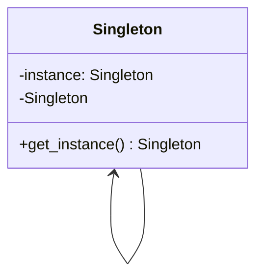

# Singleton / Borg

Implementação clássica:

```python
from __future__ import annotations


class Singleton:
    instance: Singleton

    def __new__(cls) -> Singleton:
        if not hasattr(cls, 'instance'):
            cls.instance = super().__new__(cls)
        return cls.instance
```

Implementação do borg:

```python
class Borg:
    _shared_state = {}
    def __init__(self):
        self.__dict__ = self._shared_state
```

## Um passo para trás!

Alguns conceitos que precisamos revisitar antes de entender os padrões!

### Classe vs Instância

Uma coisa que precisa ficar clara antes de discutirmos o padrão `Singleton` é sobre as diferenças entre uma classe e uma instância.

Pense em uma classe como uma representação de algo. Quando me refiro a um "aluno" é suposto que é alguém que frequenta salas de aula. É uma entidade abstrata, pode se referir a qualquer pessoa. Não necessariamente a um indivíduo. Nos referimos em época eleitoral ao "cidadão". Um stigma abstrato, um simbolo não material de algo.

Já a instância, pode contra partida, tem um péssimo nome. É fruto de um anglicismo, quando uma palavra não é traduzida do inglês, mas adaptada para nosso idioma. O termo `Instance` pode ser traduzido como um exemplar de algo. Por exemplo, em uma piscina de bolinhas existem bolas. Quando seleciono uma, me refiro diretamente a um exemplar único de todas as bolinhas presentes na piscina.

Dado esse contexto, podemos partir para uma representação do contexto.

Uma classe `Aluno`:

```python
class Aluno:
    def __init__(self, nome, ra):
        self.nome = nome
        self.ra = ra
```

Essa classe representa a abstração de um aluno. Todos os alunos compartilham das mesmas características. Eles tem um nome e um registro de aluno. Podemos dizer também que todos os alunos podem verificar suas notas em um portal acadêmico, executando uma ação específica de alunos:


```python
from typing import Literal


class Aluno:
    def __init__(self, nome, ra, curso):
        self.nome = nome
        self.ra = ra
        self.curso = curso

    def nota(
        self,
        avaliação: Literal['p1', 'p2', 'p3', 'final'],
        diciplina
    ):
        portal.checa_avaliação(self.ra, avaliação, diciplina) # abstração!
```

É evidente que todos os alunos dentro do domínio do sistema tenham os mesmos atributos (nome, ra e curso) e todos podem checar suas notas no portal. Porém, essa é a forma abstrata de pensar em um aluno.

Já a instância, o exemplar, é um aluno concreto, que existe no sistema. Vamos a ele:

```python
fausto = Aluno('Fausto', '0816192313', 'Tecnologia em magias')
fausto.nota('final', 'futurologia 1')
```

Quando nos referimos a `fausto` estamos no referindo a alguém que de fato "existe" além da representação abstrata. Não só tem os atributos, como atribuí valores a ele.

### Atributos e métodos

Uma coisa interessante e que deve ser levada em consideração quando falamos sobre atributos e métodos é que eles podem pertencer a estrutura geral (a classe) ou ao exemplar dessa classe (a instância).

Vamos imaginar uma classe que detêm um atributo:

```python
class C:
   atributo = 'valor'
```

Essa classe, como uma estrutura, não precisa de uma instância definida para acessar o atributo:

```python
>>> C.atributo
'valor'
```

Isso cria uma certa hierarquia de atributos. Onde a classe pode ter seus próprios e a instância pode ter os seus.

O mesmo vale para métodos. Existem métodos que são relacionados a estrutura:

```python
class C:
    @classmethod
    def metodo_de_classe(cls):
        return 'Fui chamado!'
```

### Padrão criacional

Quando nos referimos a padrões de projeto criacionais, estamos nos referindo especificamente a formas de criação de "instâncias". A preocupação desses padrões está em como um exemplar de uma classe específica será criado, de qual forma isso está acontecer. Com qual mecanismo a instância será criada.

Existem diversos padrões como `Builder`, `Factory`, `Prototype` e `Singleton`:

- Builder: Criação de instâncias em etapas
- Factory: Interfaces padrões para criação de objetos distintos
- Prototype: Criação de uma nova instância partindo de um clone de uma existente
- Singleton: Garantir que uma classe crie apenas uma instância e forneça um ponto global de acesso.

A alteração da criação nesses padrões é feita por atributos e métodos de classe.


## Singleton

A ideia por trás de um singleton é alterar a forma de criação de um objeto. Fazendo com que só exista uma única instância do mesmo e fornecer uma interface padrão de acesso.



### Singleton GOF

Vamos a implementação do singleton original:

```python
from __future__ import annotations


class Singleton:
    instance: Singleton

    @classmethod
    def get_instance(cls) -> Singleton:
        if not hasattr(cls, 'instance'):
            cls.instance = Singleton()
        return cls.instance
```

Contudo, não é possível isolar a construção do objeto de forma privada. Embora possamos padronizar o acesso:

```python
>>> s0 = Singleton.get_instance()
>>> s1 = Singleton.get_instance()

>>> s0 is s1
True
```


### O uso do padrão
#### Exemplo de singleton clássico

Na biblioteca padrão temos uma forma de uso clara para o uso de singletons e elas usam uma interface padrão. A biblioteca de `logging`:

```python
import logging

logger = logging.getLogger()

logger.warning('Tá certo isso Arnaldo?')
```

#### Um caso concreto de uso de singleton

Imagine que você precisa persistir uma conexão com o banco de dados. Fazer ela diversas vezes além de demorado pode oferecer alguns outros problemas:

```python
from __future__ import annotations
from time import sleep


class Database:
    instance: Database

    @classmethod
    def get_instance(cls) -> Database:
        if not hasattr(cls, 'instance'):
            cls.instance = Database()
        return cls.instance

    def __init__(self):
        self.conn = self._get_conn()

    def _get_conn(self):
        sleep(3)
        return 'Con'
```


#### O caso das variáveis globais

Um outro caso interessante de uso do singleton é o carregamento de um estado global. Onde ecampsulamos diversas variáveis em uma classe. Vamos imaginar o carregamento de variáveis de ambiente. Para isso vou usar o Pydantic:

```python
from pydantic_settings import BaseSettings, SettingsConfigDict

class Settings(BaseSettings):
    model_config = SettingsConfigDict(env_file='.env')

    API_KEY: str
```

Toda vez em que a classe `Settings` for instanciada, o arquivo `.env` será lido novamente. A solução seria transformar essa classe em um singleton:

```python
from pydantic_settings import BaseSettings, SettingsConfigDict

class Settings(BaseSettings):

    @classmethod
    def get_instance(cls) -> Settings:
        if not hasattr(cls, 'instance'):
            cls.instance = Settings()
        return cls.instance

    model_config = SettingsConfigDict(env_file='.env')

    API_KEY: str
```

Porém, existem soluções mais idiomáticas!

## Não vivemos de GOF
### Singleton em construtores públicos:

Um dos pontos críticos de pensar nessa forma de acesso em python é que só existem métodos públicos, nada restringe que seja criada uma instância nova:


```python
>>> s0 = Singleton()
>>> s1 = Singleton()

>>> s0 is s1
False
```

Como esse problema pode ser resolvido? Mudando o construtor da classe!

```python
from __future__ import annotations


class Singleton:
    instance: Singleton

    def __new__(cls) -> Singleton:
        if not hasattr(cls, 'instance'):
            cls.instance = super().__new__(cls)
        return cls.instance
```

Dessa forma, temos um ponto de acesso único (que é o construtor) e também uma garantia que toda instância será a mesma:

```python
>>> s0 = Singleton()
>>> s1 = Singleton()

>>> s0 is s1
True
```


### Padrões de projetos são funcionalidades faltantes em linguagens?

Uma discussão na wiki.c2 mostra que com o uso de metaclasses, não existe de fato uma necessidade de uma implementação padrão de singleton, podemos usar uma estrutura de outro objeto para representar a construção do que queremos. Dessa forma impedindo a nova criação de uma instância.

Python suporta metaclasses por padrão, então vamos a elas:

```python
class MetaSingleton(type):
    _instances = {}

    def __call__(cls, *args, **kwargs):
        if cls not in cls._instances:
            cls._instances[cls] = super().__call__(*args, **kwargs)
        return cls._instances[cls]


class Singleton(metaclass=MetaSingleton):
    ...


>>> s0 = Singleton()
>>> s1 = Singleton()
>>> s0 is s1
True
```

### Peter Norvig e as linguagens dinâmicas

Para Norvig a implementação de um singleton em um caso clássico de memoização. O que pode ser resolvido com o cache do python:

```python
from functools import cache


@cache
class Singleton:
    ...

>>> s0 = Singleton()
>>> s1 = Singleton()
>>> s0 is s1
True
```

### O caso das funções / módulos

```python
class _Singleton: ...

sing = _Singleton()

def Singleton():
   return sing

>>> s0 = Singleton()
>>> s1 = Singleton()
>>> s0 is s1
True
```

### PolySingleton

A ideia do polySingleton é separar instâncias por contexto. O objetivo é que exista somente uma única instância por contexto.

Embora possam existir diversas soluções para isso, vou usar a do memoize:

```python
from functools import cache


@cache
class Singleton:
    def __init__(self, context=None):
        self.context = context

>>> s0 = Singleton()
>>> s1 = Singleton()
>>> s2 = Singleton('context2')
>>> s0 is s1, s0 is s2
True, False
```

Agora que conhecemos o conceito de polysingleton, podemos voltar a biblioteca de logs nativa:

```python
import logging

logger_context1 = logging.getLogger('context1')
logger_context2 = logging.getLogger('context2')

logger_context1.warning('Tá certo isso Arnaldo?')
logger_context2.warning('Tá certo isso Arnaldo?')
```

---


## Borg (MonoState)

Em "Five Easy Pieces: Simple Python Non-Patterns", Martelli vai nos mostrar que talvez o problema que o singleton tente resolver não precisa ser necessariamente envolver a criação de uma instância única, mas sim o compartilhamento de estado entre diversas instâncias. Logo, instâncias diferentes tendem a ter um estado único:

```python
class Borg:
    _shared_state = {}
    def __init__(self):
        self.__dict__ = self._shared_state
		

>>> b0 = Borg()
>>> b1 = Borg()
>>> b0 is b1
False

>>> b0 == b1
False

>>> b0.a = 10
>>> b1.a
10
```

### RegisBorg

```python
class RegisBorg:
    _instances = {}
	def __init__(self, context):
        if not context in self._instances:
            self._instances[context] = self.__dict__
        else:
            self.__dict__ = self._instances[context]
```

### MetaBorg

```python
class MetaBorg(type):
	_state = {}
	def __call__(cls, *args, **kwargs):
		if cls not in cls._state:
			cls._state[cls] = cls.__new__(cls)
		return cls._state[cls]


class C(metaclass=MetaBorg): ...
```

### MetaRegisBorg

```python
class MetaRegisBorg(type):
	_state = {}
	def __call__(cls, context, *args, **kwargs):
		if (cls, context) not in cls._state:
			cls._state[(cls, context)] = cls.__new__(cls)
		return cls._state[(cls, context)]
```

## Referências

- Livro padrões de projeto (GOF): https://archive.org/details/designpatternsel00gamm/page/126/mode/2up
- wiki c2 - Singleton: https://wiki.c2.com/?SingletonPattern
- Wiki c2 - Padrões são funcionalidades faltantes?: https://wiki.c2.com/?AreDesignPatternsMissingLanguageFeatures
- Peter Norvig - Padrões de projetos em linguagens dinâmicas: http://www.norvig.com/design-patterns/design-patterns.pdf
- Apresentação do Borg por Martelli: https://code.activestate.com/recipes/66531-singleton-we-dont-need-no-stinkin-singleton-the-bo/
- Alex Marterlli - Five Easy Pieces: http://www.aleax.it/5ep.html
- Referência para o nome Borg: https://en.wikipedia.org/wiki/Borg
- Refactoring Guru - Padrão singleton: https://refactoring.guru/pt-br/design-patterns/singleton
- Victor E. Bazterra - Python Borg, and the new MetaBorg?: https://baites.github.io/computer-science/patterns/singleton-series/2018/06/11/python-borg-and-the-new-metaborg.html
