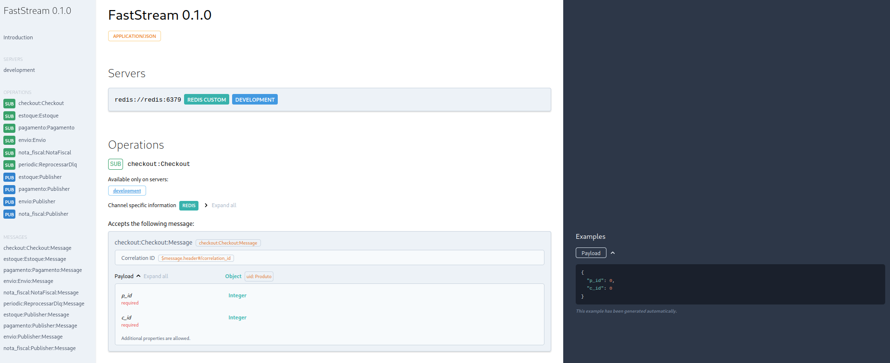

<!-- class: title -->


# Live de Python # 294


## Event-Driven Archtecture com FastStream

---

<!-- class: summary -->

<style scoped>
section.summary .lado-a p,
section.summary .lado-b p{
margin-bottom: 30%;
}
</style>


# Roteiro

<div class="lados">
<div class="lado-a">

1. Event-Driven Archtecture

(EDA) Um pouco de teoria antes :)

2. FastStream

Uma introdução ao pub/sub

</div>

<div class="lado-b">

3. Lidando com erros

retry, backoff e etc...

4. Agendamento

Usando bibliotecas externas

</div>

---

<!-- _class: help -->

# Ajude o projeto

<figure>

<figcaption>apoia.se/livedepython</figcaption>
</figure>
<figure>

<figcaption>pix.dunossauro@gmail.com</figcaption>
</figure>
<figure>

<figcaption>patreon.com/dunossauro</figcaption>
</figure>

---

<!-- _class: apoia -->

Albano Maywitz, Alexandre Costa, Alexandre Harano, Alexandre Lima, Alexandre Takahashi, Alexandre Villares, Alfredo Braga, Alfredo Neto, Alynnefs, Alysson Oliveira, Andre Makoski, André Oliveira, Andre Paula, Antonio Filho, Apc 16, Apolo Ferreira, Artur_farias_, Athayr_, Aurelio Costa, Azmovi, Belisa Arnhold, Beltzery, Bernardo Fontes, Bernarducs, Biancarosa, Brisa Nascimento, Bruno Batista, Bruno Bereoff, Bruno Freitas, Bruno Ramos, Bruno Russian, Bug_elseif, Canibasami, Caoptic, Carlos Gonçalves, Carlos Henrique, Cauã Oliveira, Celio Araujo, Christian Fischer, Claudemir Cruz, Cleiton Fonseca, Controlado, Curtos Treino, Daniel Aguiar, Daniel Brito, Daniel Bruno, Daniel Souza, Daniel Wojcickoski, Danilo Boas, Danilo Silva, Darcioalberico_sp, David Couto, Dh44s, Diego Guimarães, Dilan Nery, Dunossauro, Edgar, Elias Soares, Emerson Rafael, Érico Andrei, Esdras, Everton Silva, Ewertonbello, Fábio Belotto, Fabio Faria, Fabiokleis, Fecar995, Felipe Adeildo, Felipe Augusto, Felipe Corrêa, Fernanda Prado, Fernandocelmer, Ferrabras, Fichele Marias, Fightorfall, Francisco Aclima, Franklin Sousa, Frederico Damian, Fulvio Murenu, Gabriel Lira, Gabriel Mizuno, Gabriel Paiva, Gabriel Simonetto, Geilton Cruz, Geisler Dias, Giuliano Silva, Glauber Duma, Gnomo Nimp, Grinaode, Guibeira, Guilherme Felitti, Guilherme Ostrock, Gustavo Pedrosa, Gustavo Suto, Harold Gautschi, Heitor Fernandes, Hellyson Ferreira, Helton, Helvio Rezende, Henri Alves, Henrique Andrade, Henrique Machado, Henriquesebastiao, Herian Cavalcante, Hiago Couto, Idlelive, Ivan Santiago, Ivansantiagojr, Janael Pinheiro, Jean Victor, Jeferson Vitalino, Jefferson Antunes, Jerry Ubiratan, Jhonata Medeiros, Jhon Gonçalves, João Pena, Joao Rocha, Joarez Wernke, Jonas Araujo, Jonatas Leon, Jose Barroso, Joseíto Júnior, José Predo), Josir Gomes, Jota_lugs, Jplay, Jrborba, Ju14x, Juan Felipe, Juli4xpy, Juliana Machado, Julio Franco, Julio Gazeta, Julio Silva, Kaio Peixoto, Kakaroto, Knaka, Lara Nápoli, Leandro Pina, Leandro Vieira, Leonardo Mello, Leonardo Nazareth, Lilian Pires, Lisandro Pires, Lucas Carderelli, Lucas Castro, Lucasgcode, Lucas Mello, Lucas Mendes, Lucas Nascimento, Lucas Polo, Lucas Schneider, Luciano_ratamero, Luciano Ratamero, Lúcia Silva, Luidduarte, Luis Ottoni, Luiz Duarte, Luiz Martins, Luiz Paula, Luiz Perciliano, Marcelo Araujo, Marcelo Fonseca, Marcio Freitas, Marcos Almeida, Marcos Oliveira, Marina Passos, Mateusamorim96, Matheus Mendez, Matheus Vian, Medalutadorespacialx, Michael Santos, Mlevi Lsantos, Mrnoiman, Murilo Carvalho, Nhambu, Omatheusfc, Oopaze, Otávio Carneiro, Patrick Felipe, Pytonyc, Rafael Ferreira, Rafael Fontenelle, Rafael Lopes, Rafael Romão, Raimundo Ramos, Ramayana Menezes, Ramon Lobo, Renan, Renan Sebastião, Renato José, Rene Pessoto, Renne Rocha, Ricardo Silva, Ricardo Viana, Richard Sousa, Rinaldo Magalhaes, Robsonpiere, Rodrigo Barretos, Rodrigo Santana, Rodrigo Vieira, Rogeriocampos7, Rogério Nogueira, Rui Jr, Rwallan, Samael Picoli, Samanta Cicilia, Santhiago Cristiano, Scrimf00x, Scrimfx, Sherlock Holmes, Shinodinho, Shirakawa, Sommellier_sr, Tarcísio Miranda, Tenorio, Téo Calvo, Teomewhy, Tharles Andrade, Thiago, Thiago Araujo, Thiago Lucca, Thiago Paiva, Thisiscleverson, Tiago, Tomás Tamantini, Trojanxds, Valdir, Varlei Menconi, Vinicius Silva, Vinicius Souza, Vinicius Stein, Vittu_dt, Vladimir Lemos, Vonrroker, Waltennecarvalho, Williamslews, Willian Lopes, Xxxxxxxxx, Zero! Studio

# Obrigado você <3

---

<!-- class: s-yellow -->

## Arquitetura de eventos!
# EDA

---

<!-- class: d-red -->

<style scoped>
h3 {
    margin-left: 35px;
    margin-right: 10px;
	margin-bottom: 0px;
	font-family: "Roboto"
}
blockquote {
	margin-top: 0px;
	margin-bottom: 35px;
    margin-left: 26%;
}
</style>

# Arquitetura dirigida por eventos

### "(...) A arquitetura dirigida por **eventos** é um estilo de arquitetura **distribuída** **assíncrona** popularmente usada para produzir aplicações altamente **escaláveis** e de **alto desempenho**. Também é altamente adaptável e pode ser usada tanto para aplicações pequenas quanto para as grandes e complexas."

> RICHARDS, Mark; FORD, Neal. Fundamentals of software architecture

*Very jargonic...*

---

<!-- class: d-red -->

<style scoped>
h3 {
    margin-left: 35px;
    margin-right: 10px;
	margin-bottom: 0px;
	font-family: "Roboto"
}
blockquote {
	margin-top: 0px;
	margin-bottom: 35px;
    margin-left: 26%;
}
</style>

# Arquitetura dirigida por eventos

### "(...) A arquitetura dirigida por **eventos** é um estilo de arquitetura **distribuída** **assíncrona** popularmente usada para produzir aplicações altamente **escaláveis** e de **alto desempenho**. Também é altamente adaptável e pode ser usada tanto para aplicações pequenas quanto para as grandes e complexas."

> RICHARDS, Mark; FORD, Neal. Fundamentals of software architecture

*Very jargonic...* É...

- **Eventos**
- **Distribuída**
- **Assíncrona**
- **Escalável**
- **Alto desempenho**

---

<!-- class: d-yellow -->

<style scoped>
li {
   margin-bottom: 15px;
}
</style>

# Vamos termo a termo...

- **Distribuída**: Arquitetura onde os componentes estão espalhados por múltiplos servidores ou locais, colaborando para realizar tarefas.
- **Assíncrona**: Comunicação onde o remetente não espera uma resposta imediata, permitindo que o sistema continue processando outras tarefas.
- **Escalável**: Capacidade do sistema de aumentar sua capacidade de processamento adicionando mais recursos conforme a demanda cresce.
- **Alto desempenho**: Resposta rápida e eficiente do sistema, mesmo sob cargas elevadas, garantindo que as operações sejam realizadas em tempo adequado.
- **Eventos**: Ocorrências ou mudanças no sistema que são detectadas e tratadas, permitindo que componentes se comuniquem por mensagens.

---

<!-- class: d-red -->

# Vamos dar um passo atrás...

Na arquitetura tradicional, APIs se comunicam entre si via **requisições HTTP**, onde uma atua como **cliente** e outra como **servidor**.

Esse modelo é **sincrônico**: quem faz a requisição precisa **esperar a resposta** para continuar.


<div class="mermaid">
sequenceDiagram
    participant Cliente
    participant API_A as API A (Cliente)
    participant API_B as API B (Servidor)
    Cliente->>API_A: HTTP Request (POST /pedido)
    API_A->>API_B: HTTP Request (GET /estoque)
    API_B-->>API_A: HTTP Response (200 OK)
    API_A-->>Cliente: HTTP Response (201 Created)
</div>

---

<!-- class: d-yellow -->

# Agora, com eventos...

Na arquitetura dirigida por eventos, os serviços não ficam esperando respostas. Eles **disparam eventos** em um canal de mensagens e **seguem em frente**.

Quem estiver interessado nesses eventos pode reagir a eles, de forma **independente**.

<div class="mermaid">
flowchart LR
  subgraph subGraph0["Outro sistema"]
    A["Broker"]:::broker
  end
  subgraph subGraph1["Outros sistemas"]
    S0["Ouvinte 1"]:::listener
    S1["Ouvinte 2"]:::listener
    S2["Ouvinte 3"]:::listener
  end
  C0["Cliente"] --> P0["API / Publicador"]
  P0 --> C0
  P0 -- evento --> A
  A -->|tópico A| S0
  A -->|tópico B| S1
  A -->|tópico C| S2
  A@{ shape: das}
  classDef broker fill:#f9f,stroke:#333,stroke-width:2px;
  classDef listener fill:#9cf,stroke:#333,stroke-width:1.5px;
</div>

O grande ponto aqui é que **quem publica** o **evento** **não conhece quem ouve** o evento. **Desacoplando** de forma **distribuída** o processamento.

Não é necessário **conhecer** a API chamada, como no modelo passado.

---

<!-- class: d-red -->

# Um exemplo às vezes diz mais que tudo...

Imagine um sistema de compras online.

Quando clicamos em "comprar", diversas coisas acontecem por trás disso. Por exemplo:

1. Precisamos ser checar no estoque se existe
2. Validar o pagamento
3. Emitir nota fiscal
4. Delegar à logística
5. ...

Imagina ter que esperar por tudo isso pra "confirmar" que você comprou.

---

<!-- class: d-yellow -->

# Distribuído e Assíncrono

Então, a ideia por trás é delegar tarefas para outros subsistemas de forma assíncrona.

O sistema principal emite **eventos**

<div class="mermaid">
flowchart RL
	A["Broker"]:::broker
	subgraph subGraph1["Ouvintes / Subscribers"]
		S0["Compras"]:::listener
		S1["Estoque"]:::listener
		S2["Pagamento"]:::listener
		S3["Notas"]:::listener
	end
	P0 --> DB
	S0 ---> DB
	S1 ---> DB
	S2 ---> DB
	S3 ---> DB
	P0["Publicador"] -- Compra --> A
	A -->|Compra| S0
	S0 -- Estoque,</br>Pagamento --> A
	A -->|Estoque| S1
	A -->|Pagamento| S2
	S2 -->|Nota| A
	A -->|Nota| S3
	A@{ shape: das}
	DB@{ shape: cyl}
	classDef broker fill:#f9f,stroke:#333,stroke-width:2px;
	classDef listener fill:#9cf,stroke:#333,stroke-width:1.5px;
</div>

Onde os sistemas de forma distribuída emitem mensagens sem esperar a resposta do outro.

---

<!-- class: c-red -->

Um exemplo é sempre bom, às vezes diz mais que tudo...

# Vamos lá

---

<!-- class: d-yellow -->

# E se algo der errado?

Com eventos, é possível lidar com erros sem travar o fluxo principal.

Por exemplo: se um ouvinte falhar ao processar um evento, os demais ainda continuam funcionando normalmente.

<div class="mermaid">
flowchart LR
	subgraph Sistema
		A["Broker"]:::broker
		P0["API / Publicador"]
		S1["Ouvinte A"]:::listener
		S2["Ouvinte B (falha) ❌"]:::error
		S3["Ouvinte C"]:::listener
	end
	C0["Cliente"] --> P0
	P0 -- evento --> A
	A --> S1
	A --> S2
	A --> S3
	A@{ shape: das}
	classDef broker fill:#f9f,stroke:#333,stroke-width:2px;
	classDef listener fill:#9cf,stroke:#333,stroke-width:1.5px;
	classDef error fill:#faa,stroke:#900,stroke-width:2px;
</div>

Mesmo que uma parte do sistema falhe, o restante continua processando eventos normalmente.

---

<!-- class: d-red -->

# Retry

Como os eventos são desacoplados, o erro, apesar de não gerar impacto em toda a cadeira, algumas coisas precisam acontecer.

Uma das estratégias é tentar de novo. Um `retry`. O que não impacta nenhum outro "ouvinte".

<div class="mermaid">
flowchart LR
	A[Broker]:::broker@{ shape: das}
	A -- 1. Consome a mensagem --> B[Serviço de Processamento]
	B -- 2. Falha de processamento --> C{Tentativa?}
	C -- Sim, tentativa 1 --> B
	B -- 3. Falha de novo --> C
	C -- Sim, tentativa 2 --> B
	B -- 4. Sucesso! --> D[Processado]
	B -- 4. Falha de novo<br>e limite atingido --> E[Erro fatal]
	classDef broker fill:#f9f,stroke:#333,stroke-width:2px;
</div>

---

<!-- class: d-yellow -->

# Dead Letter Queue (DLQ)

A ideia da DLQ é "guardar" os eventos que falharam após o limite de `retry` ser atingido.

Esses eventos "envenenados" são movidos para uma fila separada, evitando que eles congestionem a fila principal. A **DLQ** serve como um local para a equipe de desenvolvimento inspecionar, diagnosticar e, se necessário, reprocessar as mensagens problemáticas.

<div class="mermaid">
flowchart LR
    subgraph Fila Principal
        direction LR
        A[Mensagem 1] --> B[Mensagem 2] --> C[Mensagem 3]
    end
    subgraph Processamento
        P[Processador]
    end
    Fila_Principal --> P
    P -- Falha definitiva --> DLQ[Dead Letter Queue<br>❌]
    classDef broker fill:#f9f,stroke:#333,stroke-width:2px;
    classDef listener fill:#9cf,stroke:#333,stroke-width:1.5px;
    classDef error fill:#faa,stroke:#900,stroke-width:2px;
</div>

---

<style scoped>
img {
    width: 100%;
	filter: drop-shadow(0px 5px 15px var(--shadow));
}
</style>


<!-- class: d-red -->

# AsyncAPI

Bom... por fim, é interessante saber que existe uma forma de documentar seus eventos. Assim como o `redoc` ou `swagger` para APIs baseadas em eventos.

O [`AsyncAPI`](https://www.asyncapi.com/en):



---

<!-- class: s-yellow -->

## Uma introdução ao
# Fast</br>Stream

---

<style scoped>
img {
    width: 180px;
	filter: drop-shadow(0px 5px 15px var(--shadow));
}
span {
	margin-left: -10px;
}
</style>

<!-- class: d-red -->

# FastStream

Uma biblioteca para lidar com sistemas de mensageria em Python. Com suporte a diversos brokers e com a simplicidade inspirada no FastAPI. Suporte à programação assíncrona (asyncio) e serialização via pydantic.


<div class=lados>
<span>

- Licença: Apache 2.0
- Primeira release: Novembro de 2023
- Release atual: `0.5.48` -- 21/12/2025
- 0.6 em release candidate 2 (14/08/2025)
- Downloads nesse mês: `409.540`
- Suporta integrações com [frameworks web](https://faststream.ag2.ai/latest/getting-started/integrations/frameworks/) e com OTel

</span>
<div>


</div>
</div>

É a junção de duas bibliotecas que apresentavam comportamentos similares:

- `FastKafka`: Pydantic + `AIOKafka` + AsyncAPI
- `Propan`: Pydantic + `AIOPika` + AsyncAPI


---

<!-- class: d-yellow -->

# Suporte a brokers

Um dos grandes trunfos do `FastStream` é suportar diversos sistemas de mensageria.

- **Kafka**
- **Redis**: Vamos usar esse, o @taconi esolheu na twitch xD
- **Nats**
- **Rabbit**
- **Confluent**

Vamos subir o container:

```bash
podman run -p 6379:6379 docker.io/redis
```

---

<!-- class: d-yellow -->

# Instalação

Para a instalação inicial, podemos usar:

```bash
pip install faststream
```

Mas eu recomendo essa instalação inicial:

```bash
pip install faststream[redis,cli]
```

- Todo broker precisa ser instalado individualmente
  - redis, kafka, rabbit, nats, confluent
- O CLI vai nos permitir executar o faststream pelo terminal

---

<!-- class: d-red -->
# Exemplo básico

Podemos começar com algo assim:

```python
from faststream import FastStream
from faststream.redis import RedisBroker

broker = RedisBroker('redis://localhost:6379')
app = FastStream(broker)


@broker.subscriber('test')
async def handler(message):
    return message
```

Para executar o sub no CLI:

```bash
faststream run serve exemplo_00:app --workers 4 # se escalar, dá :)
```

---

<!-- class: nb-yellow -->

# Publicando uma mensagen na fila

Você pode usar uma ferramenta gráfica para Redis, como o [Tiny RDM](https://redis.tinycraft.cc/).

Ou a biblioteca do redis em um serviço qualquer em qualquer linguagem:

```python
from redis import Redis

r = Redis()

r.publish('test', 'mensagem maluca!')
```

<div class="mermaid">
flowchart TD
	P0[Pub] -->|mensagem| A[Broker]@{ shape: das }
	P1[Pub] -->|mensagem| A
	P2[Pub] -->|mensagem| A
</div>


---

<!-- class: d-red -->

# Escutando e executando

Os subscribers esperam mensagens em tópicos específicos da fila de mensagens.

<div class="mermaid">
flowchart TD
	P0[Pub] -->|mensagem + T| A[Broker]@{ shape: das }
	A -->|:test:|S0[SUB]
	A -->|:compras:|S1[SUB ]
	A -->|:pagamentos:|S3[SUB]
	A -->|:xpto:|S4[SUB]
</div>

---

<!-- class: d-yellow -->

# Olhando o CLI

Algo como isso deve ser exibido:

```bash
- test | 9b9ecc3d-a - Received
- test | 9b9ecc3d-a - Processed
```

Mostrando que a mensagem foi recebida no tópico de test e, em seguida, foi processada.

---

<!-- class: d-red -->

# Testando o evento

A forma de testar de forma unitária o evento é chamando a função diretamente:

```python
import pytest  # pip install pytest-asyncio
from faststream.redis import TestRedisBroker


@pytest.mark.asyncio
async def test_handler():
    assert await handler('teste') == 'teste'


@pytest.mark.asyncio
async def test_handler_integration():
    async with TestRedisBroker(broker) as br:
        response = await br.request('teste', channel='test')
        assert response.body.decode() == 'teste'
```

---

<!-- class: d-yellow -->

# Pydantic

A ideia por trás do uso do pydantic é poder validar e serializar as entradas. Fazendo com que seja mais simples trabalhar com os eventos.


```python
from pydantic import BaseModel

class Event(BaseModel):
    id: int | None = None
    message: str


@broker.subscriber('test')
async def handler(trace_id: int, modelo_do_evento: Event):
    return trace_id, modelo_do_evento
```

Ele vai validar tanto os campos como `trace_id`, quanto o modelo `Event`.

---

<!-- class: d-red -->

<style scoped>
img {
    width: 100%;
	filter: drop-shadow(0px 5px 15px var(--shadow));
}
</style>

# AsyncAPI

Quando usamos o pydantic, da mesma forma que o FastAPI faz, ele cria uma visualização da `AsyncAPI`. Documentando o formato e os tipos dos eventos:

```bash
faststream docs serve exemplos.exemplo_01:app
```


---

<!-- class: d-yellow -->


# Injeção de dependência

Por padrão, o `FastStream` instala o `FastDepends` (dos mesmos criadores), fazendo com que injetar outras funções seja bastante simples:

```python
from fast_depends import Depends

async def get_session():
    yield ...

@broker.subscriber('test')
async def handler(
    modelo_do_evento: Event,
    session = Depends(get_session)
):
    ...
    return modelo_do_evento
```

---

<!-- class: d-red -->

# Pub/Sub

Por já contar com o broker instanciado, você pode encadear as chamadas, fazendo um resultado ser públicado em outro tópico:

```python
@broker.subscriber('topico_a')
async def handler_a(modelo_do_evento: Event):
    # Chamada
    await broker.publish(modelo_do_evento, 'topico_b')

@broker.subscriber('topico_b')
async def handler_b(modelo_do_evento: Event):
    return modelo_do_evento
```

Isso vai fazer um evento de um `sub` publicar para outro.

---

<!-- class: d-yellow -->

# Decoradores / pipe

Uma forma bastante interessante de fazer isso no `FastStream` é a capacidade de o retorno de uma função ser retornado ao broker em outro tópico:


```python
@broker.subscriber('topico_a')
@broker.publisher('topico_b')
async def handler_a(modelo_do_evento: Event):
    return modelo_do_evento

@broker.subscriber('topico_b')
async def handler_b(modelo_do_evento: Event):
    return modelo_do_evento
```

Nesse sentido, de aninhamento de decoradores, uma função pode ser `sub` de quantos tópicos quiser e `sub` também. Podendo gerar um fluxo de mensagens complexo.

---

<!-- class: s-red -->

# Erros
## Lidando com eles

---

<!-- class: d-yellow -->

# Lidando com erros!

Essa é uma parte bastante diferente do `FastStream`. Em comparação com outras ferramentas, como celery, dramatiq e etc...

Ele não lida com erros de forma nativa. Mas sugere uma biblioteca competente que se integra muito bem ao fluxo das funções. O [Tenacity](https://tenacity.readthedocs.io/en/latest/).

Que oferece:

- Retries
- Backoff
- Callbacks
- ...

```bash
pip install tenacity
```

---

<!-- class: d-red -->

# Em caso de erro, faça de novo...

Um exemplo não tão simples... mas completo

```python
from tenacity import retry, stop_after_attempt, wait_random_exponential

@broker.publisher('estoque')
@retry(
    # Tente novamente 5 vezes
    stop=stop_after_attempt(5),
    # Espere de forma exponencial entre as tentativas
    wait=wait_random_exponential(multiplier=1, max=60),
    # Caso as cinco tentativas deem errado, chame um callback
    retry_error_callback=on_final_failure
    # A função `on_final_failure` é responsável pelo DLQ, por exemplo...
)
async def checkout(produto: Produto, logger: Logger) -> int: ...
```

---

<!-- class: d-yellow -->

# Se não der...

A gente bota pra DLQ.

> Nesse caso em específico, o redis não suporta DQL nativamente como o `rabbitmq` ou `kafka`.

```python
async def on_final_failure(retry_state):
    redis = broker._connection

    data = retry_state.kwargs.copy()
    message = json.dumps({retry_state.fn.__name__: data})

    await redis.lpush('DLQ', message)
```

`lpush` insere a mensagem em uma lista, que pode ser consumida depois...

---

<!-- class: s-red -->

# Agenda</br>mento
## De tarefas

---

<!-- class: d-yellow -->

# Agendamento

A ideia do agendamento é fazer a publicação de uma mensagem de tempos em tempos, por exemplo.

A vida é cheia de eventos periódicos:

- Fechamento diário de caixa
- Balanço mensal
- Consultar a DLQ
- Efetuar pagamentos
- Compras
- ...

---

<!-- class: d-red -->

<style scoped>
h3 {
    margin-left: 35px;
    margin-right: 10px;
	margin-bottom: 0px;
	font-family: "Roboto"
}
</style>

# Agendamento

Esse é um outro tópico do qual o `FastStream` não toma conta sozinho. Como diz a [documentação](https://faststream.ag2.ai/latest/scheduling/):

### "Infelizmente, essa funcionalidade conflita com a ideologia original do FastStream e não pode ser implementada como parte do framework. No entanto, é possível integrar o agendamento ao seu aplicativo FastStream usando algumas dependências extras. E nós temos algumas dicas de como fazer isso."

<br>

Existem algumas recomendações de ferramentas como `Taskiq` e o `Rocketry`. Como a grande recomendação é o `Taskiq`, por criarem um plugin para ele:

```bash
pip install taskiq-faststream
```

---

<!-- class: d-yellow -->

# Taskiq

Montando algo como:

```python
broker = RedisBroker()
app = FastStream(broker)
# Taskiq
taskiq_broker = BrokerWrapper(broker)

taskiq_broker.task(
    channel='periodic',                  # Tópico
    message='',                          # Conteúdo
    schedule=[{'cron': '*/5 * * * *'}],  # A cada 5 minutos
)

scheduler = StreamScheduler(
    broker=taskiq_broker,
    sources=[LabelScheduleSource(taskiq_broker)],
)
```

---

<!-- class: d-red -->

# Taskiq

A chamada também deve ser alterada. Fazendo com que a chamada de CLI seja a do Taskiq:

```bash
taskiq scheduler module:scheduler
```

---

<!-- _class: help -->

# Ajude o projeto

<figure>

<figcaption>apoia.se/livedepython</figcaption>
</figure>
<figure>

<figcaption>pix.dunossauro@gmail.com</figcaption>
</figure>
<figure>

<figcaption>patreon.com/dunossauro</figcaption>
</figure>

---

<!-- class: red -->

# Referências

- AG2AI. FastStream - FastStream. Disponível em: <https://faststream.ag2.ai/latest/>. Acesso em: 21 ago. 2025. 
- RICHARDS, Mark; FORD, Neal. Fundamentals of software architecture: an engineering approach. First edition ed. Sebastopol, CA: O’Reilly Media, Inc, 2020. 
- Tenacity — Tenacity documentation. Disponível em: <https://tenacity.readthedocs.io/en/latest/#>. Acesso em: 25 ago. 2025. 


<!-- Mermaid.js CDN -->
<script type="module">
import mermaid from 'https://cdn.jsdelivr.net/npm/mermaid@11/dist/mermaid.esm.min.mjs';
mermaid.initialize({
startOnLoad: true,
theme: 'forest'
});
</script>
