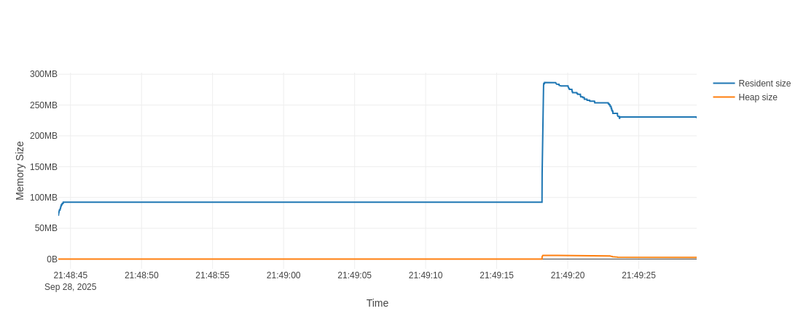
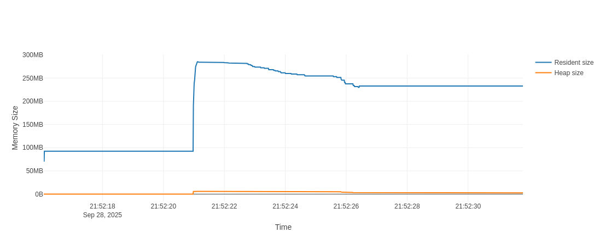

<!-- class: title -->


Novidades do python 3.14
# Live de Python # 299

---

<!-- class: c-red -->

Gostaria de agradecer ao time do i18n brasileiro. Enquanto montava essa live, uns 90% do que li para montar já estava traduzido.

# Uma coisa importante

---


<!-- class: c-yellow -->

Gostaria de pedir aqui no chat um agradecimento coletivo <3

# Uma coisa importante

---


<!-- class: summary -->

# Roreiro
<div class="lados">
<div class="lado-a">

1. Gerais

Melhorias, debugers, cores, ...

2. Plafaformas

Windows, Linux, Mac, ...

3. Bibliotecas

pathlib, uuid, zstandard, annotationlib

</div>

<div class="lado-b">

4. Sintaxe

Alterações e coisas novas

5. Intepretador

Coisas novas do cpython

6. O que não tem caixa

O que não coube em nenhum grupo xD

</div>

</div>

---

<!-- _class: help -->

# Ajude o projeto

<figure>

<figcaption>apoia.se/livedepython</figcaption>
</figure>
<figure>

<figcaption>pix.dunossauro@gmail.com</figcaption>
</figure>
<figure>

<figcaption>patreon.com/dunossauro</figcaption>
</figure>

---

<!-- _class: apoia -->

Albano Maywitz, Alexandre Costa, Alexandre Harano, Alexandre Lima, Alexandre Takahashi, Alexandre Villares, Alfredo Braga, Alfredo Neto, Alynnefs, Alysson Oliveira, Andre Makoski, André Oliveira, Andre Paula, Antonio Filho, Apc 16, Apolo Ferreira, Artur_farias_, Aurelio Costa, Azmovi, Belisa Arnhold, Beltzery, Bernardo Fontes, Bernarducs, Biancarosa, Brisa Nascimento, Bruno Batista, Bruno Bereoff, Bruno Freitas, Bruno Ramos, Bruno Russian, Brunu, Canibasami, Caoptic, Carlos Gonçalves, Carlos Henrique, Cauã Oliveira, Celio Araujo, Christian Fischer, Claudemir Cruz, Cleiton Fonseca, Controlado, Curtos Treino, Daniel Aguiar, Daniel Brito, Daniel Bruno, Daniel Souza, Daniel Wojcickoski, Danilo Boas, Danilo Silva, Darcio Alberico, Darcioalberico_sp, David Couto, David Frazao, Dh44s, Diego Guimarães, Dilan Nery, Dunossauro, Edgar, Elias Soares, Emerson Rafael, Érico Andrei, Esdras, Everton Silva, Ewertonbello, Fábio Belotto, Fabio Faria, Fabiokleis, Felipe Adeildo, Felipe Augusto, Felipe Corrêa, Fernanda Prado, Fernandocelmer, Ferrabras, Fichele Marias, Fightorfall, Francisco Aclima, Franklin Sousa, Frederico Damian, Fulvio Murenu, Gabriel Lira, Gabriel Mizuno, Gabriel Paiva, Gabriel Simonetto, Geilton Cruz, Geisler Dias, Giuliano Silva, Glauber Duma, Gleidson Costa, Gnomo Nimp, Grinaode, Guibeira, Guilherme Felitti, Guilherme Ostrock, Gustavo Pedrosa, Gustavo Suto, Harold Gautschi, Heitor Fernandes, Hellyson Ferreira, Helton, Helvio Rezende, Henri Alves, Henrique Andrade, Henrique Machado, Henriquesebastiao, Herian Cavalcante, Hiago Couto, Idlelive, Igor Souza, Ivan Santiago, Ivansantiagojr, Janael Pinheiro, Jean Victor, Jeferson Vitalino, Jefferson Antunes, Jerry Ubiratan, Jhonata Medeiros, João Pena, Joao Rocha, Joarez Wernke, Jonas Araujo, Jonatas Leon, Jonatas_silva11, Jose Barroso, Joseíto Júnior, José Predo), Josir Gomes, Jota_lugs, Jplay, Jrborba, Ju14x, Juan Felipe, Juli4xpy, Juliana Machado, Julio Cesar, Julio Franco, Julio Gazeta, Julio Silva, Kaio Peixoto, Kakaroto, Killfacept, Knaka, Krisquee, Laraalvv, Leandro Pina, Leandro Vieira, Leonardo Mello, Leonardo Nazareth, Lilian Pires, Lisandro Pires, Lucas Carderelli, Lucas Castro, Lucasgcode, Lucas Mello, Lucas Mendes, Lucas Nascimento, Lucas Polo, Lucas Schneider, Luciano_ratamero, Luciano Ratamero, Lúcia Silva, Luidduarte, Luis Ottoni, Luiz Duarte, Luiz Martins, Luiz Paula, Luiz Perciliano, Marcelo Araujo, Marcelo Fonseca, Marcio Freitas, Marcos Almeida, Marcos Oliveira, Marina Passos, Mate65br, Mateusamorim96, Matheus Mendez, Matheus Vian, Medalutadorespacialx, Michael Santos, Mlevi Lsantos, Murilo Carvalho, Nhambu, Oopaze, Otávio Carneiro, Patrick Felipe, Programming, Rafael Ferreira, Rafael Fontenelle, Rafael Lopes, Rafael Romão, Raimundo Ramos, Ramayana Menezes, Ramon Lobo, Renan, Renan Sebastião, Renato José, Rene Pessoto, Renne Rocha, Ricardo Silva, Ricardo Viana, Richard Sousa, Rinaldo Magalhaes, Robsonpiere, Rodrigo Barretos, Rodrigo Santana, Rodrigo Vieira, Rogério Nogueira, Rui Jr, Samael Picoli, Samanta Cicilia, Santhiago Cristiano, Scrimf00x, Scrimfx, Shinodinho, Shirakawa, Sommellier_sr, Tarcísio Miranda, Tenorio, Téo Calvo, Teomewhy, Thamires Betin, Tharles Andrade, Thiago, Thiago Araujo, Thiago Lucca, Thiago Paiva, Tiago, Tomás Tamantini, Valdir, Varlei Menconi, Vinícius Areias, Vinicius Silva, Vinicius Souza, Vinicius Stein, Vitoria Trindade, Vladimir Lemos, Vonrroker, Williamslews, Willian Lopes, Will_sca, Xxxxxxxxx, Yannzin, Zero! Studio

# Obrigado você <3

---

<!-- class: s-yellow -->

## Melhorias e novidades
# Gerais

---

<!-- class: d-red -->

# Melhoria nas mensagens de erro

Desde a versão 3.10 o python vem recebendo melhorias em mensagens de erro.

A versão 3.14 foi a que recebeu mais novos casos em todas as versões:

- Sugestões de palavras chave
- Erros de unpack
- Strings dentro de strings
- Erros com `as`
- Erros com hashables
- Prefixos incompatíveis de strings
- `if` como expressão + palavras reservadas
- Palavras chave após `else`

---

<!-- class: d-yellow -->

# Sugestões para palavras-chave

Agora as palavras-chave tiveram os erros melhorados.

3.14:

```python
>>> forr x in [1, 2, 3]:
  File "<python-input-1>", line 1
    forr x in [1, 2, 3]:
    ^^^^
SyntaxError: invalid syntax. Did you mean 'for'?
```

3.13:

```python
>>> forr x in [1, 2, 3]:
  File "<python-input-1>", line 1
    forr x in [1, 2, 3]:
         ^
SyntaxError: invalid syntax
```

---

<!-- class: d-red -->

# Erros de unpack

Antes só mostrava quantos eram esperados, mas não quantos vieram:

```python
>>> a, b = 1, 2, 3
Traceback (most recent call last):
  File "<python-input-0>", line 1, in <module>
    a, b = 1, 2, 3
    ^^^^
ValueError: too many values to unpack (expected 2, got 3)
```

Erro anterior:
```python
ValueError: too many values to unpack (expected 2)
```

---

<!-- class: d-yellow -->

# Prefixos de strings

Agora, quando os prefixos são incompatíveis, o erro diz que eles não podem ser usados em conjunto

```python
>>> bt''
  File "<python-input-3>", line 1
    bt''
    ^^
SyntaxError: 'b' and 't' prefixes are incompatible
```

---

<!-- class: d-red -->

# `as` e hashables

O `as`:

```python
import ast as arr[0]
  File "<python-input-1>", line 1
    import ast as arr[0]
                  ^^^^^^
SyntaxError: cannot use subscript as import target
```

Erros com hashables:

```python
>>> {['chave']: 'valor'}
Traceback (most recent call last):
  File "<python-input-0>", line 1, in <module>
    {['chave']: 'valor'}
TypeError: cannot use 'list' as a dict key (unhashable type: 'list')
```

---

<!-- class: d-yellow -->

# `elif` após `else`

Agora temos erros para quando a ordem das instruções não é respeitada do bloco `if`:

```python
>>> if val:
...     ...
... else:
...     ...
... elif not val:
...     ...
...
  File "<python-input-5>", line 5
    elif not val:
    ^^^^
SyntaxError: 'elif' block follows an 'else' block
```

---

<!-- class: d-red -->

# expressões `if` e keywords

Agora, quando qualquer palavra chave for usada no lugar das expressões, uma mensagem de erro específica será retornada:

```python
>>> 1 if True else pass
  File "<python-input-6>", line 1
    1 if True else pass
                   ^^^^
SyntaxError: expected expression after 'else', but statement is given


>>> pass if True else False
  File "<python-input-7>", line 1
    pass if True else False
    ^^^^
SyntaxError: expected expression before 'if', but statement is given
```

---

<!-- class: s-yellow -->

## Debuggers, Debuggers
# Debug</br>gers

---

<!-- class: d-red -->

# Debugger remoto

**SIM! YAY!** Agora dá pra usar o pdb em **outro processo** enquanto ele está sendo executado.

```python
# xpto.py
from time import sleep

d = {}

while True:
    print(f'loop {d=}')
    sleep(5)
```

```bash
# pegar o processo
ps aux | grep xpto.py
# Ativar o debugger no processo
python -m pdb -p {processo}
```

---

<!-- class: d-yellow -->

# Debugger remoto

Mas, calma, não vai funcionar de cara xD

Precisamos falar sobre [permissões](https://docs.python.org/3.14/howto/remote_debugging.html#remote-debugging-attachment-protocol)

Vamos tentar de novo:

```bash
# Ativar o debugger no processo
python -m pdb -p {processo}
```

---

<!-- class: d-red -->

# Introspecção no asyncio

Agora é possível inspecionar, ao nível de processo, as tarefas que estão acontecendo em tempo de execução.

```bash
# pega o pid
ps aux | grep xpto.py

# olha a arvore
python -m asyncio pstree {processo}
```

Agora precisamos de um código rodando :)

Lambrando que... [permissões](https://docs.python.org/3.14/howto/remote_debugging.html#remote-debugging-attachment-protocol)

---

<style scoped>

code {
	font-size: 15px;
}

pre {
	font-size: 0px;
}

</style>

# Introspecção no asyncio

continuando...

```python
# asyncio_debug_test.py
from asyncio import gather, run, sleep as asleep
from time import sleep

async def maybe():
    print('maybe')
    await asleep(10)

async def task(n):
    print(f'task start - {n}')
    if n % 2:
        await maybe()
    await asleep(10)
    print(f'task end - {n}')

async def main():
    while True:
        sleep(3)
        await gather(*[task(x) for x in range(10)])

run(main())
```

---

<style scoped>

code {
	font-size: 18px;
}

pre {
	font-size: 0px;
}

</style>

# E então...

Nem cabe na tela. hahaha

```bash
python -m asyncio pstree 937475
└── (T) Task-1
    └──  main /home/dunossauro/live_299/asyncio_debug_test.py:20
        ├── (T) Task-43
        │   └──  task /home/dunossauro/live_299/asyncio_debug_test.py:13
        │       └──  sleep /home/dunossauro/.../asyncio/tasks.py:702
        ├── (T) Task-45
        │   └──  task /home/dunossauro/live_299/asyncio_debug_test.py:13
        │       └──  sleep /home/dunossauro/.../asyncio/tasks.py:702
        ├── (T) Task-47
        │   └──  task /home/dunossauro/live_299/asyncio_debug_test.py:13
        │       └──  sleep /home/dunossauro/.../asyncio/tasks.py:702
        ├── (T) Task-49
        │   └──  task /home/dunossauro/live_299/asyncio_debug_test.py:13
        │       └──  sleep /home/dunossauro/.../asyncio/tasks.py:702
        └── (T) Task-51
            └──  task /home/dunossauro/live_299/asyncio_debug_test.py:13
                └──  sleep /home/dunossauro/.../asyncio/tasks.py:702
```

---

<!-- class: d-yellow -->

<style scoped>

code {
	font-size: 15px;
}

pre {
	font-size: 0px;
}

</style>

# Outra forma de visualização

Outra forma de ver é o `ps`:

```bash
python -m asyncio ps {processo}
```

Que obviamente não vai saber na tela. Então, cortei muitos nomes, mas vamos ver no shell...

```bash
python -m asyncio ps 937475
tid     t id    task name   coroutine stack          a chain   a name    awaiter id
---------------------------------------------------------------------------------------
937475  0x7f74  Task-1      main                                         0x0
937475  0x7f74  Task-112    sleep -> task            main      Task-1    0x7f7432d24
937475  0x7f74  Task-113    sleep -> maybe -> task   main      Task-1    0x7f7432d24
937475  0x7f74  Task-114    sleep -> task            main      Task-1    0x7f7432d24
937475  0x7f74  Task-115    sleep -> maybe -> task   main      Task-1    0x7f7432d24
937475  0x7f74  Task-116    sleep -> task            main      Task-1    0x7f7432d24
```

---

<!-- class: s-red -->

# REPL
## Read<br>Eval<br>Print<br>Loop<br>


---

<!-- class: s-yellow -->

## Nada é mais importante que isso...
# CORES!

---

<!-- class: d-red -->

# Cores!

Agora temos cores nos CLIs:

- Calendar
- Argparse
- json
- unittest

Calendar:
```bash
python -m calendar
```

Argparse:
```bash
python -m json.tool --help
```

---

<!-- class: d-yellow -->

# Json

Também no json:

```bash
python -m json.tool test.json
{
    "key": "value",
    "pei": true,
    "au": 7
}
```

e no unittest:

```python
python -m unittest teste_unittest.py
```

---

<!-- class: s-red -->

# Plataforma
## Onde roda python 3.14?

---

<!-- class: d-yellow -->

# Plataformas

[PEP 11](https://peps.python.org/pep-0011/):

- Emscripten ([PEP 776](https://peps.python.org/pep-0776/))
  - Falhas ainda não bloqueiam o build
  - Não tem distribuição oficial (use o pyodide)
- Android agora tem build oficial
  - Atualmente usado somente pelo briefcase (acho :)


---

<!-- class: s-red -->

# Biblio<br>tecas
## pathlib, compression, uuid, annotationlib

---

<!-- class: d-yellow -->

# pathlib

Agora a `pathlib` faz as operações do `shutil`, como:

Copia:

```python
>>> Path('test.json').copy('test2.json')
Path('test2.json')
```

Move:

```python
>>> Path('test.json').move('test2.json')
Path('test2.json')
```

Também entraram métodos como `move|copy_into()`. Que copia ou move o arquivo para um diretório existente específico.


---

<!-- class: d-red -->

# UUID

Suporte para uuids 6, 7 e 8.

Podem ser usados via CLI:

```bash
python -m uuid -u uuid8
1f2eaa8f-a16b-82c9-8c4d-2d100676c79c
```

Ou então importando a biblioteca `uuid`:

```python
>>> from uuid import uuid7
>>> uuid7()
UUID('0199844f-db9b-70de-8ea1-9ba2dc5b3f76')
```

---

<!-- class: d-yellow -->

# Pacote `compression`

Agora existe um pacote chamado [compression](https://docs.python.org/pt-br/3.14/library/compression.html).

Que agrupa todos os módulos de compressão: `bz2`, `gzip`, `lzma` e `zlib`:

```python
from compression import gzip
import shutil

with (
    open('test.json', 'rb') as f_in,
    gzip.open('test.json.gz', 'wb') as f_out
):
    shutil.copyfileobj(f_in, f_out)
```

Dá documentação: "(...) não serão removidos sem um ciclo de descontinuação. O uso de módulos em compression é incentivado sempre que possível."

> ps: `zipfile` não está nesse módulo, pois não é compressão. Será?

---

<!-- class: d-red -->

# A nova `compression.zstd`

O módulo `compression` traz o `compression.zstd`. Um módulo completamente novo de compressão para `Zstandard`.

Um exemplo básico:

```python
from compression import zstd

data = b'Um monte de dados...'
with zstd.open("file.zst", "w") as f:
    f.write(data)
```

Acredito que valha uma live no futuro somente sobre o módulo `compression`, já que são uma coisa unificada :)

> Sério... abre uma issue...

---

<!-- class: d-yellow -->

# A nova `annotationlib` - PEP 749

A `annotationlib` é uma biblioteca para fazer introspecção de tipos de forma mais facilitada:

```python
from annotationlib import get_annotations

def xpto(a: 'int') -> 'float': ...

>>> get_annotations(xpto)
{'a': 'int', 'return': 'float'}

>>> get_annotations(xpto, eval_str=True)
{'a': <class 'int'>, 'return': <class 'float'>}
```

Mas... Vamos conversar sobre ela um pouco mais à frente, em `Sintaxe`.

---

<!-- class: s-red -->

# Sintaxe
## E suas novidades!

---

<!-- class: d-yellow -->

# PEP 758

Agora, múltiplas exceptions não precisam mais dos `()` para definir um bloco `except`:

```python
try:
    1/0
except ZeroDivisionError, ValueError:
    print('Deu ruim')
```

Isso vale para grupos de exceptions também:

```python
try:
    async with asyncio.TaskGroup() as group:
        group.create_task(coro())
        group.create_task(coro())
except* ZeroDivisionError, ValueError:
    print('Deu ruim!')
```

---

<!-- class: d-red -->

# PEP 765 - Sintax Warning no bloco `finally`

Agora, para evitar que as exceptions passem despercebidas quando o bloco `finally` suprimir um erro. Por exemplo, como um `return`:

```python
def xpto():
    try:
        ...
        raise Exception('Deu ruim!')
    except Exception:
        raise KeyboardInterrupt('Deu ruim!')
    finally:  # O que vai rolar???
       return 'OK'
```

A resposta deve ser parecida com essa:

```python
<python-input-3>:8: SyntaxWarning: 'return' in a 'finally' block
```

---

<!-- class: d-yellow -->

# PEP 765 - Sintax Warning no bloco `finally`

Esse comportamento se manifesta com qualquer coisa que faça um "goto". Como:

- `return`
- `continue`
- `break`

```python
>>> for x in range(3):
...     try:
...         1/0
...     finally:
...         print('é o que?')
...         continue
<python-input-23>:6: SyntaxWarning: 'continue' in a 'finally' block
é o que?
é o que?
é o que?
```

---

<!-- class: d-red -->

# PEP 750 - Template strings

Vai ganhar uma live específica. Por agora, somente um exemplo:

```python
from string.templatelib import Template, Interpolation

def html(template: Template) -> str:
    parts = ''
    for item in template:
        if isinstance(item, str):
            parts += item
        elif isinstance(item, Interpolation):
            val = item.value
            if isinstance(val, dict):
                parts += ' '.join(f'{k}="{v}"' for k, v in val.items())

    return parts
```

> Essa função processa um template e retorna uma string

---

<!-- class: d-yellow -->

# PEP 750 - Template strings

Exemplo de uso:

```python
attributes = {"src": "shrubbery.jpg", "alt": "looks nice"}
template = t""

>>> html(template)
''
```

Como podemos ver, o objetivo das `t-strings` é que elas sejam processadas por uma função.

`---`

Tendo um comportamento diferente das `f-strings`, `u-strings` e `r-strings`.

---

<!-- class: d-red -->

# PEP 749/649: Avaliando tipos tardiamente

Agora vai ser possível o que todos estavam esperando há anos:

```python
class C:
    def xpto(self) -> D: ...

class D: ...
```

Os tipos agora não são mais calculados de forma ansiosa. Mas sim, *lazy*. O que quer dizer que o `obj.__annotations__` é um descritor, que será calculado quando for invocado.


---

<!-- class: d-yellow -->

# PEP 749/649: Avaliando tipos tardiamente

Algo como:

```python
class function:
    def __annotate__(format, /) -> dict:
        ... # implementar

    @property
    def __annotations__(self):
        if getattr(self, '__annotate__', None):
            return self.__annotate__(1)
        else:
            return {}
```

Ganhamos um novo dunder. O `__annotate__`, que é quem de fato "calcula" as anotações de tipos do objeto.

---

<!-- class: d-red -->

# PEP 749/649: Avaliando tipos tardiamente

Como as anotações são feitas pelo `__annotate__`, precisamos entender os formatadores.

Os [formatadores](https://docs.python.org/pt-br/3.14/library/annotationlib.html#annotationlib.Format) são definidos por um `Enum`:

- `VALUE = 1`: O valor real
- `VALUE_WITH_FAKE_GLOBALS = 2`: Uso interno do objeto
- `FORWARDREF = 3`: Uma referência de proxy para o objeto definido em outro lugar
- `STRING = 4`: O valor em string

```python
>>> class C:
...     def xpto(self) -> D: ...
>>> annotationlib.get_annotations(
    C.xpto, format=annotationlib.Format.FORWARDREF
)
{'return': ForwardRef('D', owner=<function C.xpto at 0x7f7fef455fe0>)}
```

---

<!-- class: s-yellow -->

## Novidades no
# Inter<br>pretador


---

<!-- class: d-red -->

# Um novo tipo de interpretador

**RECURSO AINDA EXPERIMENTAL**

Nessa release ganhamos uma nova versão do interpretador: [issue](https://github.com/python/cpython/issues/128563).

Como uma alternativa aos interpretadores já existentes, como o `goto`, o `switch-case` e o `uop`. Dessa vez usando `tail-call`.

Essa nova versão é opcional para compiladores mais modernos (clang 19+  e em x86-64 e AArch64), compilando com a flag `--with-tail-call-interp`.

Em uma média geométrica de 3 a 5% mais rápido no `pyperformance`.

> O GCC ainda não oferece suporte a tail-call

---

<!-- class: d-yellow -->

# PEP 734: múltiplos interpretadores

Agora, oficialmente, os múltiplos interpretadores têm uma versão [estável da API](https://docs.python.org/pt-br/3.14/library/concurrent.interpreters.html).

Podem ser chamados diretamente via `concurrent`:

```python
>>> from concurrent import interpreters
>>> i = interpreters.create()
>>> i.exec('print("pei!")')
pei!
```

Atualmente, todas as chamadas ainda precisam ser feitas via strings.

Os múltiplos interpretadores (subinterpretadores), por serem chamadas novas em memória, não têm o bloqueio da GIL.


> Já fizemos uma live de python sobre esse assunto com o JS Bueno: https://youtu.be/PaTwb2ytFUg

---

<!-- class: d-red -->

# PEP 734: múltiplos interpretadores

O módulo `concurrent.futures` agora também prove um novo `Pool` de execução de tarefas:

```python
from concurrent.futures import InterpreterPoolExecutor as IPE

with IPE(max_workers=10) as pool:
    start = time.perf_counter()
    results = [pool.submit(task) for _ in range(10)]
    print([x.result() for x in results])
```

Onde `workers` são subinterpretadores e cada um resolve sua task isoladamente do interpretador principal.

> O custo de memória é bastante grande, veremos isso no final dessa live.

---

<!-- class: d-yellow -->

# PEP 744: Versões binárias para o  just-in-time

Os binários oficiais para macOS e Windows agora incluem um compilador JIT (just-in-time) experimental. Embora não seja recomendado para uso em produção, ele pode ser testado definindo com a variável de ambiente `PYTHON_JIT=1`.

Para testar, só precisamos definir a variável:

```bash
PYTHON_JIT=1 python arquivo.py
```

O status atual do JIT pode ser visto [nessa postagem do Ken](https://fidget-spinner.github.io/posts/jit-reflections.html)

---

<!-- class: d-red -->

# PEP 779: Python com threads livres é oficial

A [PEP 703](https://peps.python.org/pep-0703/) introduziu o interpretador sem GIL como experimental na versão `3.13`, fase I.

A fase II foi definida na [PEP 779](https://peps.python.org/pep-0779/), especificações para que o `no GIL`

Foram especificados os passos para o suporte oficial.

- Desempenho aceitável: No máximo 10-15% mais lento
- Uso aceitável de memória: 20%+ de consumo de memória
- APIs "comprovadamente" estáveis: para que as bibliotecas possam usar
- Documentação interna: Para que os core devs possam trabalhar

Todos esses critérios foram atendidos na versão `3.14`!

> PS*: A fase III ainda terá os critérios definidos no futuro.

> Para ver o status das bibliotecas que suportam o python sem a GIL [clique aqui!](https://hugovk.github.io/free-threaded-wheels/)

---

<!-- class: d-yellow -->

# Uma pequena comparação

Só pra gente ver uma comparação mínima em ação:

```python
from concurrent.futures import ThreadPoolExecutor as TPE


with TPE(max_workers=10) as pool:
    start = time.perf_counter()
    results = [pool.submit(task) for _ in range(50)]


print([x.result() for x in results][-1])
print(f'Tempo passado (TPE): {time.perf_counter() - start}')
```

| Versão  | Tempo passado (TPE) |
| ------- | ------------------- |
| com gil | 34.03950909300056   | 
| sem gil | 4.888323546999345   | 

---

<style scoped>
img {
  margin-left: 10px;
  margin-right: 10px;
  width: 400px;
  box-shadow: 8px 8px 15px rgba(0, 0, 0, 0.8);
}

code {
    font-size: 9px;
}

pre {
    font-size: 9px;
}

.lados {
    display: flex;
	gap: 0px;
	margin: 0px;
}

.lado-a,
.lado-b {
    flex: 1;
	margin: 0px;
}

</style>

<!-- class: red -->

# Comparando tempo e memória entre os Pools de futures

<div class="lados">

<div class="lado-a">

```python
import time
from datetime import datetime
from concurrent.futures import ThreadPoolExecutor as TPE
from concurrent.futures import ProcessPoolExecutor as PPE
from concurrent.futures import InterpreterPoolExecutor as IPE

MAX_WORKERS = 10
N_TASKS = 50

def task():
    n = 1
    for x in range(10_000_000):
        n += x + x * 2
    return n


def tpe():
    """ThreadPoolExecutor."""
    with TPE(max_workers=MAX_WORKERS) as pool:
        start = time.perf_counter()
        results = [pool.submit(task) for _ in range(N_TASKS)]

    print([x.result() for x in results][-1])
    print(f'Tempo passado (TPE): {time.perf_counter() - start}')


def ipe():
    """InterpreterPoolExecutor."""
    with IPE(max_workers=MAX_WORKERS) as pool:
        start = time.perf_counter()
        results = [pool.submit(task) for _ in range(N_TASKS)]

    print([x.result() for x in results][-1])
    print(f'Tempo passado (IPE): {time.perf_counter() - start}')


def ppe():
    """ProcessPoolExecutor."""
    with PPE(max_workers=MAX_WORKERS) as pool:
        start = time.perf_counter()
        results = [pool.submit(task) for _ in range(N_TASKS)]

    print([x.result() for x in results][-1])
    print(f'Tempo passado (PPE): {time.perf_counter() - start}')
```
</div>

<div class="lado-b">




</div>

</div>

---

<!-- class: yellow -->

<style scoped>
img {
  display: block;
  margin-left: auto;
  margin-right: auto;
  width: 770px;
  box-shadow: 8px 8px 15px rgba(0, 0, 0, 0.8);
}
</style>


---

<!-- _class: help -->

# Ajude o projeto

<figure>

<figcaption>apoia.se/livedepython</figcaption>
</figure>
<figure>

<figcaption>pix.dunossauro@gmail.com</figcaption>
</figure>
<figure>

<figcaption>patreon.com/dunossauro</figcaption>
</figure>
